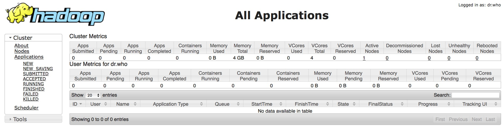
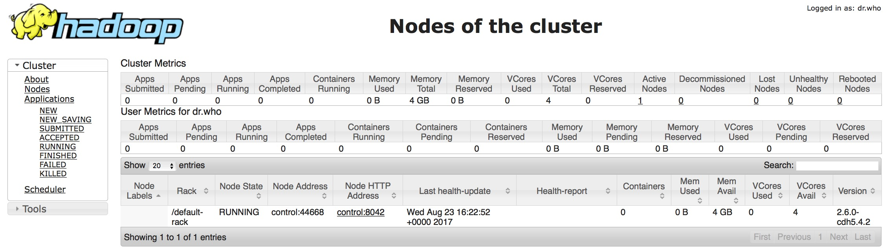
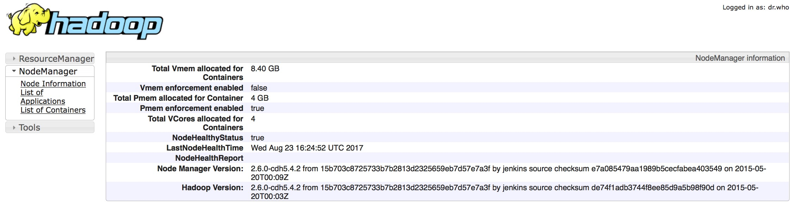

# Hadoop Architecture Labs

## Lab 1: Examining Nodes On The Cluster
At this point, YARN and the Hadoop Distributed File System (HDFS) are already running on the control node of your cluster. Both of these services have command line and Web interfaces. Let's look at both.

First, connect to the command line on your edge node using `ssh`. However, because your virtual machine is running under vagrant, you'll use the `vagrant ssh` command instead of ordinary `ssh`.

```
    vagrant ssh edge
```
	
You should see output that looks like the following:

```
Last login: Sun Aug 20 18:06:02 2017 from 10.0.2.2
[vagrant@edge ~]$
```

From this point on, we'll simply show the commands we type (as indicated by the `[vagrant@edge vagrant]$` prompt) and the result in the same code block. See what version of yarn you are running using the command `yarn version` and then `yarn application -list` to list all the applications.

```
[vagrant@edge ~]$ yarn version
Hadoop 2.6.0-cdh5.4.2
Subversion http://github.com/cloudera/hadoop -r 15b703c8725733b7b2813d2325659eb7d57e7a3f
Compiled by jenkins on 2015-05-20T00:03Z
Compiled with protoc 2.5.0
From source with checksum de74f1adb3744f8ee85d9a5b98f90d
This command was run using /usr/lib/hadoop/hadoop-common-2.6.0-cdh5.4.2.jar
[vagrant@edge ~]$ yarn application -list
17/08/22 17:42:51 INFO client.RMProxy: Connecting to ResourceManager at control/192.168.33.10:8032
Total number of applications (application-types: [] and states: [SUBMITTED, ACCEPTED, RUNNING]):0
                Application-Id	    Application-Name	    Application-Type	      User	     Queue        State	            Final-State	            Progress	              Tracking-URL
[vagrant@edge ~]$ 
```

We can get help with all the yarn commands by typing `yarn -help`

```
[vagrant@edge ~]$ yarn -help
Usage: yarn [--config confdir] COMMAND
where COMMAND is one of:
  resourcemanager -format-state-store   deletes the RMStateStore
  resourcemanager                       run the ResourceManager
  nodemanager                           run a nodemanager on each slave
  timelineserver                        run the timeline server
  rmadmin                               admin tools
  version                               print the version
  jar <jar>                             run a jar file
  application                           prints application(s)
                                        report/kill application
  applicationattempt                    prints applicationattempt(s)
                                        report
  container                             prints container(s) report
  node                                  prints node report(s)
  queue                                 prints queue information
  logs                                  dump container logs
  classpath                             prints the class path needed to
                                        get the Hadoop jar and the
                                        required libraries
  daemonlog                             get/set the log level for each
                                        daemon
 or
  CLASSNAME                             run the class named CLASSNAME
Most commands print help when invoked w/o parameters.
[vagrant@edge ~]$ 
```

We can also list the nodes in our cluster with `yarn node -list -all` and query the status of a node using `yarn node -status nodename` as shown below.

```
[vagrant@edge ~]$ yarn node -list -all
17/08/23 15:42:17 INFO client.RMProxy: Connecting to ResourceManager at control/192.168.33.10:8032
Total Nodes:1
         Node-Id	     Node-State	Node-Http-Address	Number-of-Running-Containers
   control:44668	        RUNNING	     control:8042	                           0
[vagrant@edge ~]$ yarn node -status control:44668
17/08/23 15:42:35 INFO client.RMProxy: Connecting to ResourceManager at control/192.168.33.10:8032
Node Report : 
	Node-Id : control:44668
	Rack : /default-rack
	Node-State : RUNNING
	Node-Http-Address : control:8042
	Last-Health-Update : Wed 23/Aug/17 03:40:52:695UTC
	Health-Report : 
	Containers : 0
	Memory-Used : 0MB
	Memory-Capacity : 4096MB
	CPU-Used : 0 vcores
	CPU-Capacity : 4 vcores
	Node-Labels : 

[vagrant@edge ~]$ 
```

Now we'll look at the same information using the Web interface by going to `http://192.168.33.10:8088` or `http://control:8088`. We reference the control node because that's where the Resource Manager is located. In fact, the `yarn` commands we issued above connected to the control node to get their results.

This is what your output should look like on a brand new cluster.



If we look under the `Cluster` menu on the left and click on `Nodes`, we should see the nodes that are running, just as we did above on the command line



Finally, if we click on the entry control:8042 under `Node HTTP Address`, we'll get detailed information of our one control node:



This step concludes this lab.

