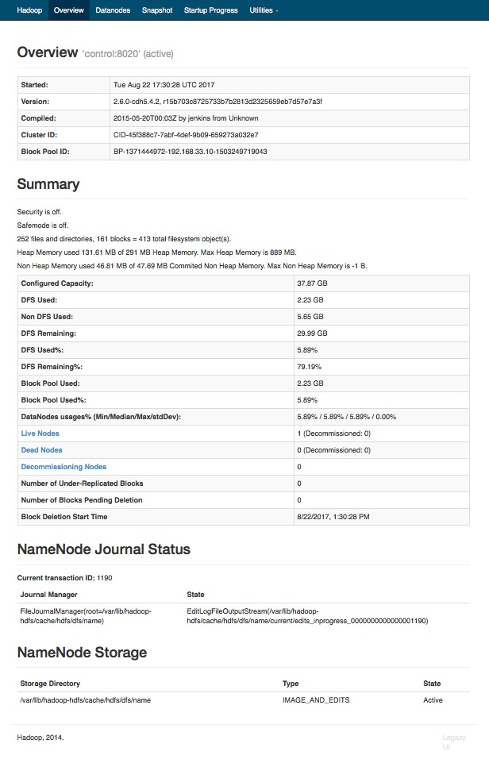
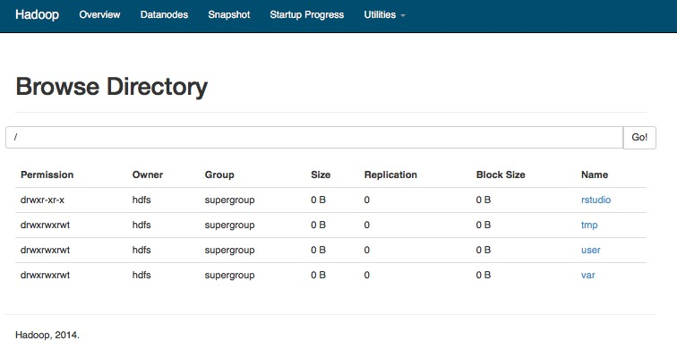
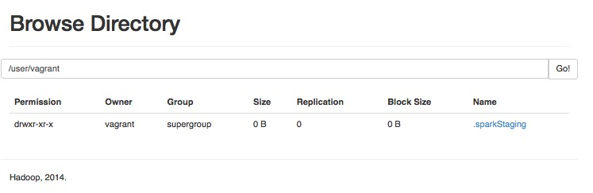

# Hadoop Architecture Labs

## Lab 2: Querying HDFS

You can also access the Hadoop Distributed File System (HDFS) from both the command line and from the Web. On the command line, we use the `hdfs` command, which has sub-commands just like the `yarn` command did.

Start by asking for help with `hdfs -help`

```text
[hadoop@ip-172-31-57-176 mnt]$ hdfs -help
Usage: hdfs [--config confdir] COMMAND
       where COMMAND is one of:
  dfs                  run a filesystem command on the file systems supported in Hadoop.
  namenode -format     format the DFS filesystem
  secondarynamenode    run the DFS secondary namenode
  namenode             run the DFS namenode
  journalnode          run the DFS journalnode
  zkfc                 run the ZK Failover Controller daemon
  datanode             run a DFS datanode
  dfsadmin             run a DFS admin client
  haadmin              run a DFS HA admin client
  fsck                 run a DFS filesystem checking utility
  balancer             run a cluster balancing utility
  jmxget               get JMX exported values from NameNode or DataNode.
  mover                run a utility to move block replicas across
                       storage types
  oiv                  apply the offline fsimage viewer to an fsimage
  oiv_legacy           apply the offline fsimage viewer to an legacy fsimage
  oev                  apply the offline edits viewer to an edits file
  fetchdt              fetch a delegation token from the NameNode
  getconf              get config values from configuration
  groups               get the groups which users belong to
  snapshotDiff         diff two snapshots of a directory or diff the
                       current directory contents with a snapshot
  lsSnapshottableDir   list all snapshottable dirs owned by the current user
						Use -help to see options
  portmap              run a portmap service
  nfs3                 run an NFS version 3 gateway
  cacheadmin           configure the HDFS cache
  crypto               configure HDFS encryption zones
  storagepolicies      list/get/set block storage policies
  version              print the version

Most commands print help when invoked w/o parameters.
[hadoop@ip-172-31-57-176 mnt]$
```

Begin by printing out the pathname for your local working directory using the `pwd` command, followed by listing its contents using `ls`. Your home diretory at `/home/vagrant` should be empty. Then list the contents of your current HDFS directory using the command `hdfs dfs -ls`. You should see different results.

```
[[hadoop@ip-172-31-57-176 mnt]$ pwd
/home/vagrant
[hadoop@ip-172-31-57-176 mnt]$ ls
[hadoop@ip-172-31-57-176 mnt]$ hdfs dfs -ls
Found 1 items
drwxr-xr-x   - vagrant supergroup          0 2017-08-20 17:29 .sparkStaging
[hadoop@ip-172-31-57-176 mnt]$ 
```

Note that your local edge node directory is located at `/home/vagrant`. Your HDFS home directory, on the other hand, is located at `/user/vagrant`. It's important to remember that these are two different file systems: the first is on your local edge node file system, and the second is in your hadoop HDFS file system.

That last directory is your HDFS home directory located at `/user/vagrant`. Now list the contents of `/`,  `/user`, and `/user/vagrant` using the `hdfs dfs -ls` command.

```
[hadoop@ip-172-31-57-176 mnt]$ hdfs dfs -ls /
Found 4 items
drwxr-xr-x   - hdfs supergroup          0 2017-08-20 20:39 /rstudio
drwxrwxrwt   - hdfs supergroup          0 2017-08-20 17:28 /tmp
drwxrwxrwt   - hdfs supergroup          0 2017-08-20 17:22 /user
drwxrwxrwt   - hdfs supergroup          0 2017-08-20 17:22 /var
[vagrant@edge ~]$ hdfs dfs -ls /user
Found 2 items
drwxrwxrwt   - hdfs    supergroup          0 2017-08-20 17:22 /user/hive
drwxrwxrwt   - vagrant supergroup          0 2017-08-20 17:28 /user/vagrant
[hadoop@ip-172-31-57-176 mnt]$ hdfs dfs -ls /user/vagrant
Found 1 items
drwxr-xr-x   - vagrant supergroup          0 2017-08-20 17:29 /user/vagrant/.sparkStaging
[hadoop@ip-172-31-57-176 mnt]$ 

```

Note that the final result there is the same as we got using `hdfs dfs -ls` with no argument.

We can accomplish the same tasks using the Web by connecting to the control node on port 50070. If you connect to `http://192.168.33.10:50070` or `http://control:50070`, you should see the NameServer Web interface shown below.



Notice the Menus at the top of the screen that allows you to drill down into the DataNodes where the data actually lives. If you select the `Utilities` pull-down menu at the upper right, you can select `Browse the file system` and see the screen below.



If you click on the `user` directory, you can then select `vagrant` and see the listing of the same file you saw in the command line example.



Note that unlike at the command line, you don't have utilities for modifying the HDFS file system from the NameNode Web interface; you can only browse the file system.

This step concludes this lab.
