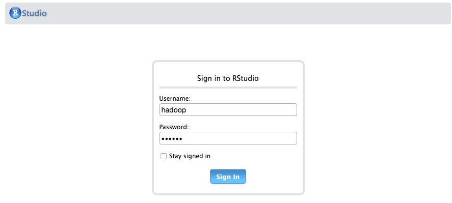
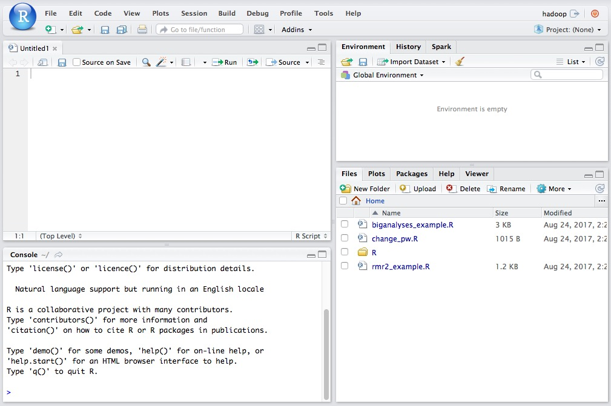

# Spark In R
## Lab 01: Connecting To RStudio Server

The goal of this lab is to ensure you can connect and use the RStudio Integrated Development Environment.

RStudio usually runs on your server on a designated node. In our case, you'll find it on port 8787. To get started with R on RStudio Server, go to

```
IPADDRESS:8787
```

Where IPADRESS is the address of the edge node on your cluster.

You should see a login screen that looks like this:



Log in with user name *hadoop*, password *hadoop*. You should then see the RStudio main screen



You'll want to open the script for the next lab in RStudio. Do the following to do this:

1. Select **Open File** from the **File** menu.
2. In the Open File window, click **...** to the right of the **Home** bar.
3. Type the path `/mnt/sparkclass/exercises/Spark-In-R` into the box labelled *Path to folder*.
4. Select the file name `02-SparkR-API.R`.

You should now have the code for the next lab displayed in the top left-hand window.

This step concludes the lab.
