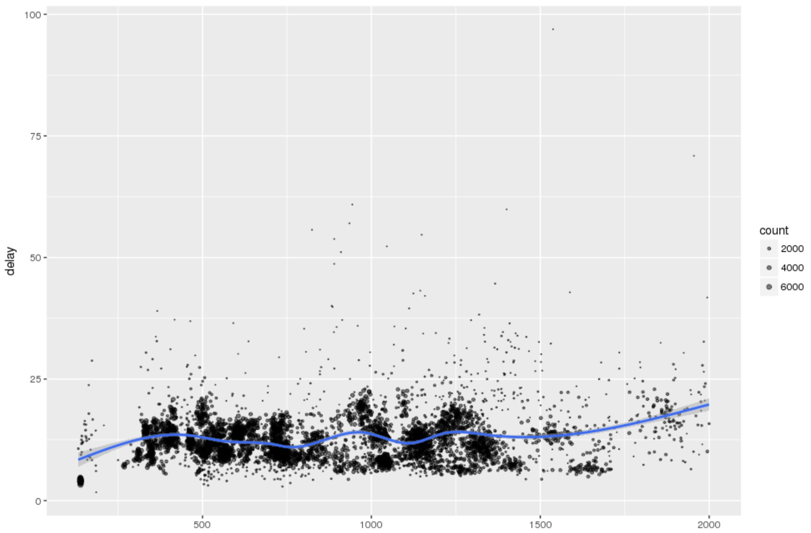

# Spark In R
## Lab 03: Coding Using Sparklyr

The goal of this lab is to introduce you to the Sparklyr package.

Sparklyr was developed by the team that built the RStudio IDE and is distributed by RStudio.com. It provides a Spark backend to the `dplyr` package but uses the traditional dplyr primitives for coding. 
Filters and aggregates Spark DataSets and brings them into R for analysis and visualization.
Allows use Spark’s of distributed machine learning library from R.
Allows extensions that call the full Spark API and provide interfaces to Spark packages.
Still relatively early in its maturity

## Setup

If you haven't done so already, connect to RStudio Server on your cluster. You can find the process for doing so in Lab 01.

You can find the code for this walkthrough in `03-Sparklyr.R`.

## Initializing R For Spark
For SparkR to run properly under RStudio, it requires several environment variables to be properly set. Specifically, SparkR needs to know:

* SPARK_HOME: Where Spark is installed.
* HADOOP\_CONF\_DIR: Where the Hadoop configuration files lives.
* YARN\_CONF\_DIR: The configuration directory for YARN.

We'll set those up before we initialize Spark using the following code:

~~~r

if (nchar(Sys.getenv("SPARK_HOME")) < 1) {
  Sys.setenv(SPARK_HOME = "/usr/lib/spark") # or whereever your Spark install lives
}
if (nchar(Sys.getenv("HADOOP_CONF_DIR")) < 1) {
  Sys.setenv(HADOOP_CONF_DIR = "/etc/hadoop/conf")  # or wherever your Hadoop lives
}
if (nchar(Sys.getenv("YARN_CONF_DIR")) < 1) {
  Sys.setenv(YARN_CONF_DIR = "/etc/hadoop/conf")    # or wherever your YARN config lives
}
~~~

Now, we'll load the `magrittr` package for data pipelining and then initialize Spark. We'll request 3GB of memory for the driver program in our initialization. This typically takes about 10-15 seconds to complete because it must spin up the Spark executors.

For those R programmers who typically load the `dplyr` library on startup, you don't want to do that when working with Spark because some of the `dplyr` function names conflict with the SparkR API functions, which can result in very confusing errors.

~~~r
library(magrittr)
# please note -- do not load dplyr or you will have function name conflicts

library(SparkR, lib.loc = c(file.path(Sys.getenv("SPARK_HOME"), "R", "lib")))
sparkR.session(master = "yarn",   # execution type
   sparkConfig = list(spark.driver.memory = "3g"))s # configure driver and executors
~~~

## Getting Started With Sparklyr

First, we'll move some dataframes over to the cluster. Sparklyr has a `copy_to` function to take R data.frames and turn them into Spark tables.

```r
# copy some built-in sample data to the Spark cluster
iris_tbl <- copy_to(sc, iris)
```

For our second table, we'll read in a fairly good-sized dataset from the FAA listing all the flights in the USA since 2010. Fortunately, it's stored in *parquet* format, which includes its own schema information. We'll read that into a table `flights` using the sparklyr version of spark.read.parquet which uses underscores instead of periods:

```r
srcflights <- spark_read_parquet(sc, "flights", "/data/flightdata/parquet-trimmed")
```

We'll then trim that down using a dplyr data pipeline to only the years 2015 and 2016. We'll also eliminate a lot of the columns that we don't care about.

```r
recentflights <- srcflights %>% filter(year >= 2015)
flights <- recentflights %>% 
  select("year", "month", "dayofmonth", "flightdate", "carrier", "tailnum",
         "deptime", "depdelay", "depdelayminutes", "origin",
         "dest", "arrdelay", "arrdelayminutes",
         "distance", "airtime", "cancelled")
flights_tbl <- flights %>% mutate(date = as.Date(flightdate))
```

## Doing Analysis With Sparklyr

The best thing about Sparklyr is that once you have everything set up, you simply can work with Spark dataframes as if they were R data.frames using `dplyr` for your grouping and aggregation.

As an example, now that we've read in our `flights_tbl`, we can easily filter it using `dplyr`. Let's see the first few flights that were delayed by 2 minutes:

```r
# filter by departure delay and print the first few records
> flights_tbl %>% filter(depdelay == 2)
# Source:   lazy query [?? x 17]
# Database: spark_connection
    year month dayofmonth flightdate carrier tailnum deptime depdelay depdelayminutes origin  dest arrdelay
   <int> <int>      <int>      <chr>   <chr>   <chr>   <int>    <int>           <int>  <chr> <chr>    <int>
 1  2016     6          8 2016-06-08      AA  N795AA     832        2               2    JFK   LAX       14
 2  2016     6          7 2016-06-07      AA  N783AA    1132        2               2    LAX   JFK        7
 3  2016     6          6 2016-06-06      AA  N390AA    1112        2               2    DFW   HNL       16
 4  2016     6          4 2016-06-04      AA  N391AA     907        2               2    DFW   OGG        6
 5  2016     6          1 2016-06-01      AA  N799AA    2132        2               2    LAX   JFK        1
 6  2016     6          5 2016-06-05      AA  N792AA    1532        2               2    LAX   JFK       36
 7  2016     6         24 2016-06-24      AA  N797AA    2232        2               2    JFK   LAX       20
 8  2016     6          1 2016-06-01      AA  N3LVAA    1707        2               2    ORD   LAS      -25
 9  2016     6          5 2016-06-05      AA  N3DUAA    1707        2               2    ORD   LAS        2
10  2016     6         25 2016-06-25      AA  N3DYAA    1827        2               2    ORD   LAS        5
# ... with more rows, and 5 more variables: arrdelayminutes <int>, distance <int>, airtime <int>, cancelled <int>,
#   date <chr>
```

Now let's do something less trivial. Let's examine if there's a relationship between distance and flight delays. What we'll do is group our data by the airplane tail number, compute the mean distance that airplane flew all year and the mean arrival delay. We'll only look at airplanes that flew at least 20 flights and we'll only look at distances less than 2000 miles.

Finally, we'll take that result and plot it using ggplot2 and apply a smoothing regression to it.

Here's the code.

```r
# plot data on flight delays
delay <- flights_tbl %>% 
  group_by(tailnum) %>%
  summarise(count = n(), dist = mean(distance), delay = mean(arrdelayminutes)) %>%
  filter(count > 20, dist < 2000, !is.na(delay)) %>%
  collect()

library(ggplot2)
ggplot(delay, aes(dist, delay)) +
  geom_point(aes(size = count), alpha = 1/2) +
  geom_smooth() +
  scale_size_area(max_size = 2)
```
And it produces this fairly attractive plot:



## Machine Learning With Sparklyr

Sparklyr also includes some nice interfaces to Spark's machine learning library SparkML. This example is fairly trivial, but it takes a standard dataset about cars called `mtcars` and applies a linear regression to it using `ml_linear_regression` that attempts to relate the miles per gallon `mpg` to the vehicle weight `wt` and the number of cylinders `cyl`.

~~~r

# Machine learning example using Spark MLlib

# copy the mtcars data into Spark
mtcars_tbl <- copy_to(sc, mtcars)

# transform the data set, and then partition into 'training', 'test'
partitions <- mtcars_tbl %>%
  filter(hp >= 100) %>%
  mutate(cyl8 = cyl == 8) %>%
  sdf_partition(training = 0.5, test = 0.5, seed = 1099)

# fit a linear regression model to the training dataset
fit <- partitions$training %>%
  ml_linear_regression(response = "mpg", features = c("wt", "cyl"))
fit

summary(fit)

# get the 10th row in test data
car <- tbl_df(partitions$test) %>% slice(10)
# predict the mpg 
predicted_mpg <- car$cyl * fit$coefficients["cyl"] + car$wt * fit$coefficients["wt"] + fit$coefficients["(Intercept)"]

# print the original and the predicted
sprintf("original mpg = %s, predicted mpg = %s", car$mpg, predicted_mpg)
~~~

## Caveats
Sparklyr is rather slow compared to the SparkR API. However, the fact that it allows data scientists and analysts to exploit frameworks they already know (specifically `dplyr`) into the Spark world means it bears watching.

This step concludes the lab.
